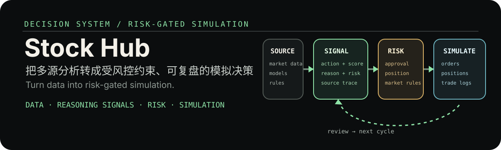

# Stock Hub

  

  <strong>AI 辅助量化决策与模拟交易平台</strong> 
  Standardize evidence into risk-gated signals, simulate execution, and review every cycle.

## 这是什么 / What it is

Stock Hub 面向量化研究与策略验证场景，连接行情、新闻、技术指标、量化策略、AI 分析与交易规则，并将它们归一为带依据和风险信息的信号。信号经过校验、审批和规则检查后进入模拟交易，结果再回流到复盘与优化流程。

Stock Hub is designed for research, backtesting, and simulated execution. It is not investment advice and it does not promise returns.

## 核心能力 / What you can do

- 管理数据连接、标的目录、同步与缓存。
- 组合技术分析、量化策略、AI/Agent 分析、新闻和规则结果。
- 将不同来源归一为结构化 ReasoningSignal，保留动作、评分、理由、风险与来源。
- 管理信号创建、校验、审批、拒绝与发布状态。
- 通过 Signal Bridge、Risk Manager 与中国市场交易规则控制订单计划。
- 记录模拟账户、持仓、交易、报告、错误分析和 Thinking Review。
- 通过 Web API、WebSocket 与前端工作台查看研究、信号、执行和复盘信息。

## 工作流 / How it works

1. 数据层接入行情、财务、新闻和标的目录。
2. 分析层运行技术指标、量化策略、AI Agent 或可选插件。
3. 系统归一生成 ReasoningSignal，并保留可解释依据。
4. 信号通过校验、审批和发布状态后，进入执行桥和风险检查。
5. 模拟网关记录订单、持仓和交易。
6. 日报、周报、Mistake Analyzer 与 Thinking Review 将结果回流为优化建议。

A model output cannot directly become an execution action. The state, rule, and risk layers are deliberate product controls.

## 快速开始 / Quick start

项目要求 Python 3.12 到 3.13。

~~~powershell
python -m venv .venv
.\.venv\Scripts\Activate.ps1
pip install -e ".[dev]"
stock-hub init
stock-hub serve --reload
~~~

打开 API：

- API: http://localhost:8080
- Health: http://localhost:8080/health
- API docs: http://localhost:8080/docs

前端独立启动：

~~~powershell
cd frontend
npm install
npm run dev
~~~

## 可选集成 / Optional integrations

核心安装用于平台与模拟研究流程。按需要安装额外集成：

~~~powershell
pip install -e ".[backtrader]"
pip install -e ".[easytrader]"
pip install -e ".[qbot]"
pip install -e ".[ai-quant]"
pip install -e ".[tradingagents]"
pip install -e ".[kronos]"
~~~

这些集成是可选适配器，不意味着所有数据源、券商接口或模型已在每个环境中配置完成。请在真实使用前检查其依赖、许可、网络连接和风险控制。

## 风险与使用边界 / Risk and use boundaries

- 默认定位是研究、回测和模拟交易，不构成投资建议。
- 不应将模型评分、新闻情绪或单一技术指标视为保证收益的依据。
- 真实资金执行需要单独的权限、合规、风控和人工审核流程。
- 回测与模拟应考虑数据可得时间、滑点、手续费、市场规则和样本外验证。

## 验证 / Verify

~~~powershell
pytest
black src tests
ruff check src tests
~~~

## 项目结构 / Project map

~~~text
src/data/            数据连接、标的目录、同步与存储
src/analysis/        策略、AI 适配、报告与研究能力
src/research/        信号生成与研究模块
src/execution/       信号桥、风险、规则与执行适配
src/trading/         模拟交易、调度、复盘与优化
src/trading_rules/   交易规则库与 API
src/web/             FastAPI、WebSocket 与前端接口
frontend/            React 工作台
tests/               自动化测试
~~~

## 许可与第三方声明 / License & third-party notices

本仓库维护者的原创贡献采用[学习与非商业使用许可](./LICENSE)：个人学习与非商业研究可免费使用；任何商业使用均须先获得著作权人的书面授权。第三方依赖、数据、模型与服务仍适用各自的许可证或条款，详见[第三方声明](./THIRD_PARTY_NOTICES.md)。

商业授权请通过本仓库的 GitHub Issues，或 [维护者主页](https://github.com/xiang949876499) 联系。

## 数据来源边界 / Data-source boundary

Tushare、AKShare 及其上游数据源不因本仓库许可证而获得再分发或商业使用授权。部署者应自行核验数据来源、市场数据许可与服务条款；使用 Tushare 时尤其不得将个人/非商业权限视为商业数据授权。
